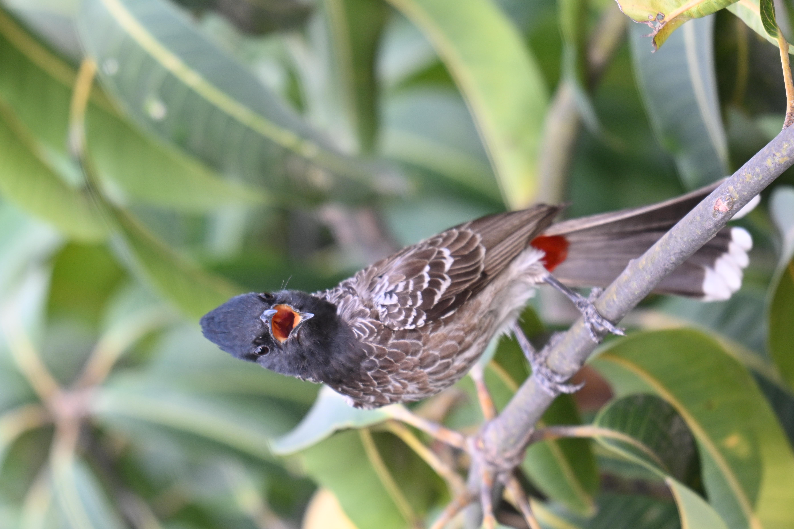
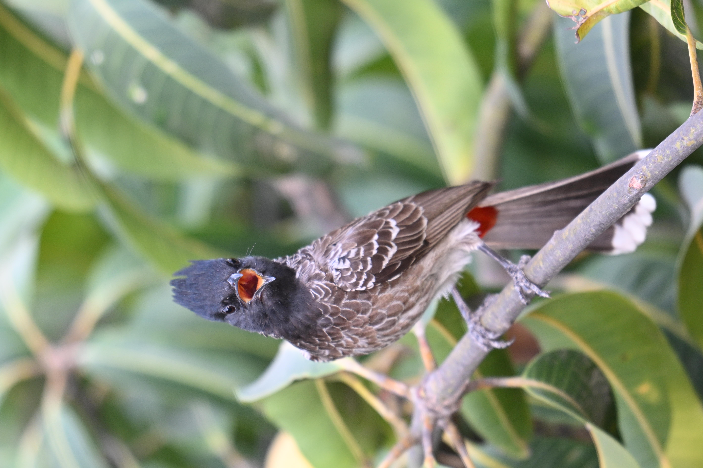
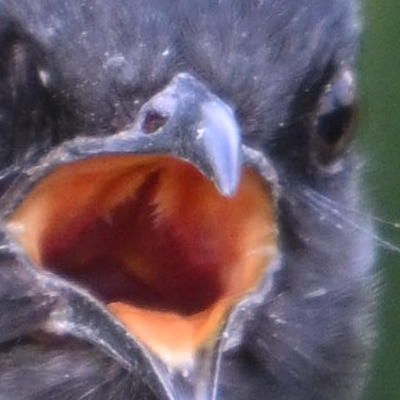
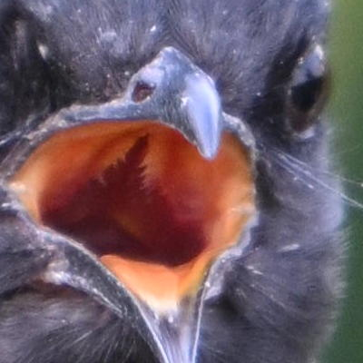

# Image Comparer

Compare images in a giffy, especially useful for pixel-peepers like me!

## Example

We want to compare the following 2 images - which one is sharper? Better focused?

Very difficult, isn't it?

Let us see both these images at 200% crop - 

Almost the same! So difficult to compare!

But what if you want to select only one image? Compare both of them to their finest accuracy - how each pixel stands out?

So this is where Image Comparator comes in!

# Demo

<video src="https://raw.githubusercontent.com/madhurpv/image-comparer/refs/heads/master/readme_files/DemoVideo.mp4"></video>

We notice that the second image (08042025_DSC_7393_Crop.JPG) is slightly sharper - a detail very hard to notice without Image Comparator!

# Features

1. Toggle images quickly to compare
2. Zoom and Pan both the images together using the mouse
3. Pan and zoom each image individually for correcting any offset in images
4. Special Blended mode for better image alignment and comparison!

# Live Page

You can use Image Comparator at - [https://madhurpv.github.io/image-comparer/](https://madhurpv.github.io/image-comparer/)
